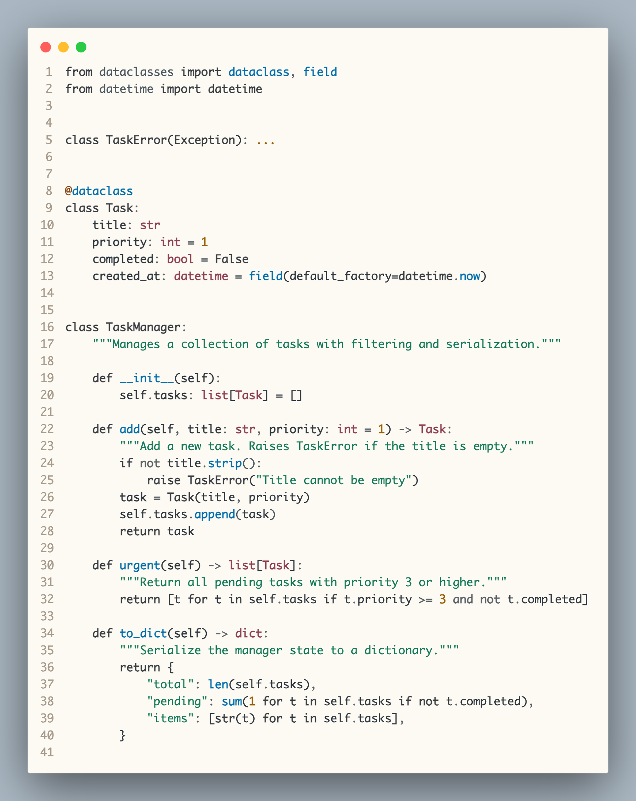
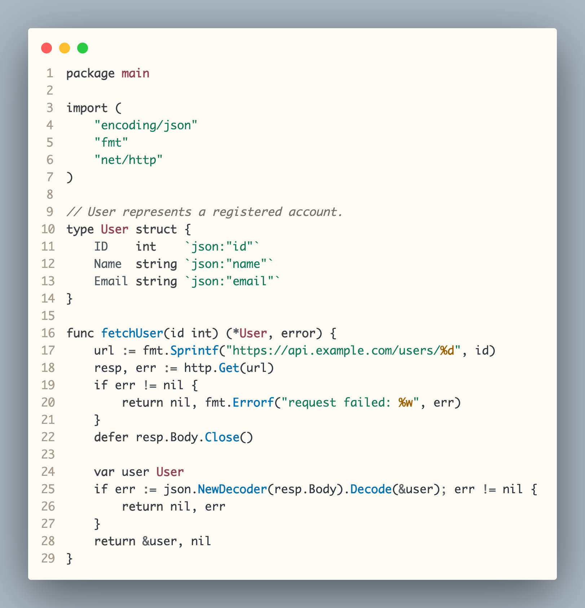
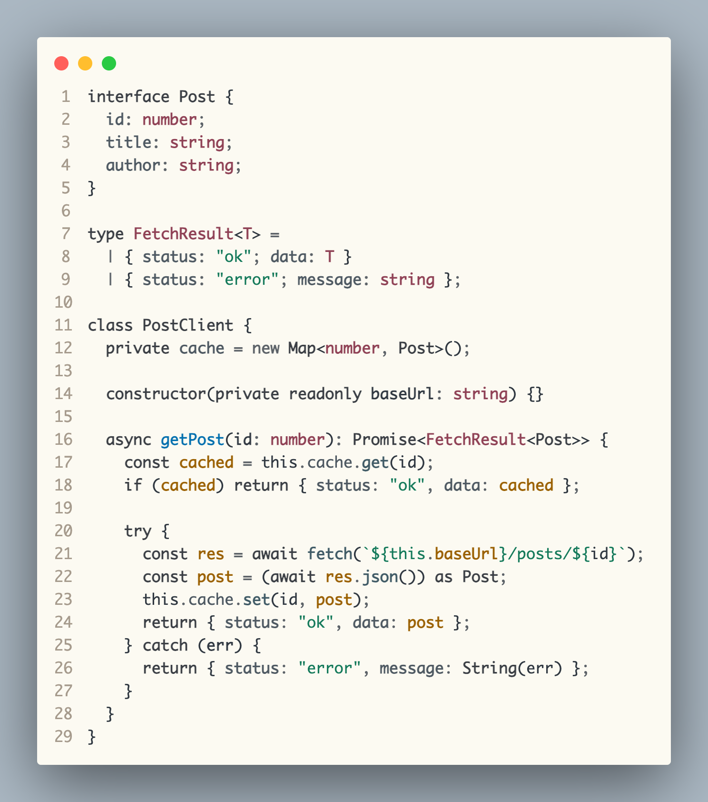

# Shokunin Light for VS Code

A rice-paper light theme for Python-focused craft: sumi classes, ume type hints, and asagi functions.

## Preview

### Python



### Go



### TypeScript



## Installation

### From Marketplace

1. Open VS Code
2. Go to Extensions (`Ctrl+Shift+X` / `Cmd+Shift+X`)
3. Search for `Shokunin Light`
4. Click **Install**
5. `Ctrl+K Ctrl+T` / `Cmd+K Cmd+T` -> select **Shokunin**

### From VSIX

1. Download the `.vsix` file from [Releases](https://github.com/Maksim-Burtsev/shokunin-theme/releases)
2. Run: `code --install-extension shokunin-light-*.vsix`

### From Source

```sh
git clone https://github.com/Maksim-Burtsev/shokunin-theme
cd shokunin-theme
npm install
npm run package
code --install-extension shokunin-light-*.vsix
```

## Palette

| Role | Color |
|---|---:|
| Paper / editor background | `#FCFAF2` |
| Main ink | `#303841` |
| Keywords / class names | `#3A3E44` |
| Functions / methods | `#006FAE` |
| Type hints | `#8F4155` |
| Strings | `#157A5B` |
| Constants / numbers | `#9A6000` |
| Comments | `#777269` |

## License

MIT
